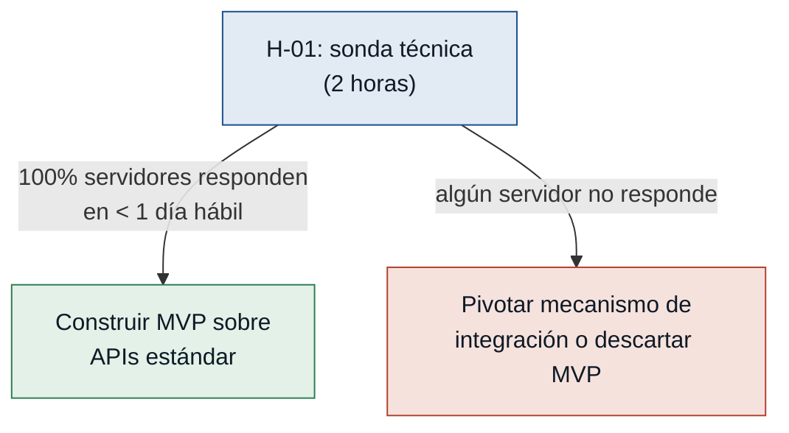
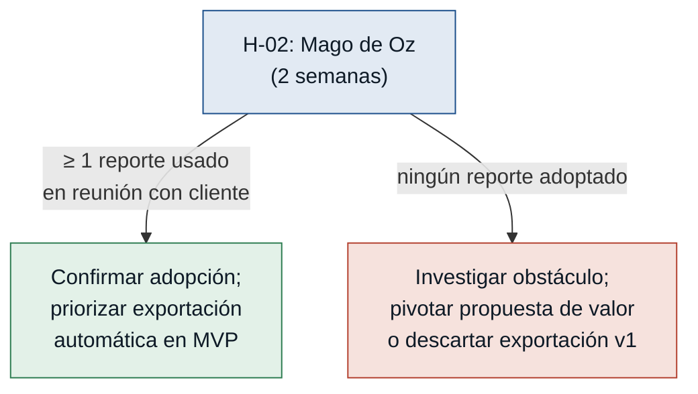
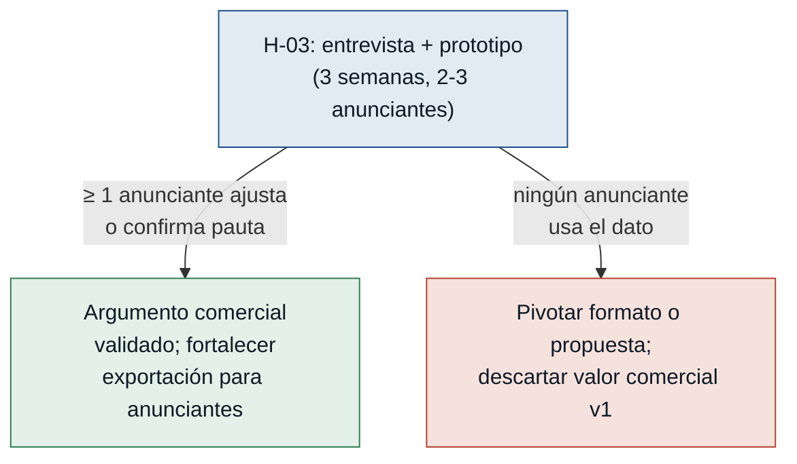

# Hipótesis y Experimentos — Radiostats

Ordenadas de mayor a menor riesgo. El experimento más barato primero: comprar
información barata sobre el riesgo más grande antes de escribir una línea de
producto.

---

### [H-01] Accesibilidad de APIs de los servidores — riesgo: alto

- **Supuesto a probar:** Los servidores Icecast y Shoutcast de la emisora exponen
  endpoints HTTP estándar que el sistema puede consultar sin modificar la
  configuración del servidor.

- **Hipótesis:** Creemos que el administrador técnico podrá conectar el sistema a
  los servidores existentes si estos exponen los endpoints HTTP documentados de
  Icecast (`/status-json.xsl`) y Shoutcast (`/stats`), porque ambos productos
  tienen páginas de estado estándar que no requieren configuración adicional.

- **Señal medible:** Porcentaje de servidores productivos de la emisora cuyo
  endpoint de estado HTTP responde con datos de audiencia válidos sin modificar
  su configuración.

- **Criterio de éxito:** El 100% de los servidores configurados responde al
  endpoint estándar en menos de 1 día hábil de prueba técnica.

- **Experimento:** Sonda técnica (script de diagnóstico): el administrador técnico
  corre un script que intenta conectarse a los endpoints conocidos de Icecast y
  Shoutcast en producción y registra si devuelven datos válidos. Sin desarrollo de
  producto; solo exploración de infraestructura.

- **Caja de tiempo/costo:** 2 horas de trabajo técnico del administrador; sin
  costo de desarrollo adicional.

- **Regla de decisión:**
  - Si pasa → construir el MVP sobre las APIs estándar sin tocar infraestructura.
  - Si falla → evaluar si se puede ajustar la configuración del servidor (pivotar
    alcance); si tampoco es viable, pivotar el mecanismo de integración (p. ej.,
    un agente instalado en el servidor); si ninguna opción cabe en el presupuesto,
    descartar el MVP tal como fue definido.

---

### [H-02] Adopción por el coordinador de marketing — riesgo: medio

- **Supuesto a probar:** El coordinador de marketing adoptará el sistema como
  fuente principal de datos de audiencia, reemplazando su dependencia de encuestas
  externas.

- **Hipótesis:** Creemos que el coordinador de marketing generará al menos 1
  reporte de audiencia usando datos del sistema en el primer mes si los datos son
  accesibles y comparables a los de las encuestas, porque su dolor declarado es
  que las encuestas llegan con meses de retraso e impiden ajustar campañas a tiempo.

- **Señal medible:** Número de reportes de audiencia generados y utilizados por el
  coordinador de marketing en negociaciones con clientes durante las primeras 4
  semanas de uso.

- **Criterio de éxito:** Al menos 1 reporte generado por el coordinador y usado
  en una reunión con un cliente o anunciante en las primeras 4 semanas, sin
  asistencia técnica del equipo de desarrollo.

- **Experimento:** Mago de Oz: durante 2 semanas el administrador técnico envía al
  coordinador resúmenes de audiencia generados manualmente con datos reales del
  sistema (CSV simple, sin dashboard completo) y registra si el coordinador los
  incorpora a sus reportes o los descarta.

- **Caja de tiempo/costo:** 2 semanas; sin desarrollo adicional de interfaz.

- **Regla de decisión:**
  - Si pasa → confirmar adopción orgánica y priorizar la exportación automática en
    el MVP.
  - Si falla → investigar si el obstáculo es la credibilidad del dato, el formato
    del CSV o la falta de incentivo real para cambiar; pivotar la propuesta de valor
    hacia el ahorro de tiempo concreto o descartar la exportación del MVP v1 y
    centrarse solo en el monitoreo técnico.

---

### [H-03] Aceptación de los datos por los anunciantes — riesgo: medio

- **Supuesto a probar:** Los anunciantes locales de la emisora aceptarán los datos
  de streaming del sistema como métricas válidas para tomar decisiones de pauta
  publicitaria.

- **Hipótesis:** Creemos que al menos 1 anunciante actual ajustará o confirmará
  una pauta publicitaria basándose en datos del sistema si se le presenta un
  reporte exportado con tendencias horarias, porque actualmente toman decisiones
  con las mismas encuestas poco frecuentes que la emisora y carecen de datos
  oportunos.

- **Señal medible:** Número de anunciantes que modifican o confirman una pauta
  publicitaria citando explícitamente datos del sistema de streaming en la reunión
  de negociación.

- **Criterio de éxito:** Al menos 1 anunciante toma o ajusta una decisión de pauta
  basada en los datos del sistema en las primeras 8 semanas de uso.

- **Experimento:** Entrevista de validación comercial con prototipo: el coordinador
  presenta a 2-3 anunciantes existentes un reporte de audiencia exportado (puede
  ser Mago de Oz si el sistema aún no está completo) y documenta si el anunciante
  lo usa para decidir su pauta.

- **Caja de tiempo/costo:** 1 reunión de seguimiento por anunciante, máximo 3
  semanas.

- **Regla de decisión:**
  - Si pasa → el argumento comercial está validado; fortalecer la exportación y
    orientar el roadmap hacia reportes para anunciantes.
  - Si falla → investigar si el problema es el formato del reporte, la credibilidad
    del dato de streaming frente a encuestas tradicionales o el mercado local;
    pivotar hacia un formato más reconocible o descartar la propuesta de valor
    comercial del MVP v1.
