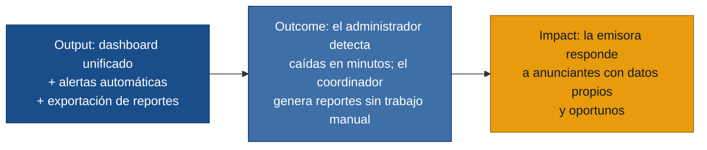

# MVP Canvas — Radiostats

## Cadena de valor del MVP

---

## Canvas

| Bloque | Contenido |
|---|---|
| **Propuesta de valor** | Un panel unificado donde la emisora ve el estado y la audiencia de todos sus servidores de streaming en tiempo real, con historial horario y exportación de reportes, eliminando la necesidad de navegar entre múltiples interfaces y de depender de encuestas externas. |
| **Segmento de usuarios** | Administrador Técnico de streaming (gestión operativa) y Coordinador de Marketing (análisis y reportes comerciales). El Director de Emisora se beneficia de los mismos datos sin ser el usuario principal del sistema. |
| **Funcionalidades mínimas** | 1. Dashboard unificado: estado (activo/caído) y oyentes actuales por servidor (US-01). 2. Total consolidado de oyentes en tiempo real (US-02). 3. Alertas automáticas de caída y recuperación de servidor (US-03). 4. Historial de audiencia con granularidad horaria y comparativa de fechas (US-04). 5. Exportación de reporte de audiencia en formato presentable (US-05). |
| **Resultado esperado (outcome)** | El Administrador Técnico detecta fallos de servidor en menos de 5 minutos, sin esperar a que un oyente llame. El Coordinador de Marketing genera reportes para clientes en minutos, sin construirlos manualmente. |
| **Métrica de éxito** | Tiempo medio desde la caída del servidor hasta la notificación al administrador ≤ 5 min (medido en las primeras 4 semanas de uso). Al menos un reporte exportado por el coordinador de marketing en el primer mes, sin trabajo manual adicional. |
| **Riesgos / supuestos** | 1. Los servidores Icecast y Shoutcast exponen APIs estándar que el sistema puede consultar sin modificar la configuración del servidor. 2. El coordinador adoptará el sistema como fuente principal de audiencia, reemplazando las encuestas externas. 3. Los anunciantes aceptarán los datos de streaming como métricas válidas para tomar decisiones de pauta. |
| **Fuera de alcance (por ahora)** | Ver abajo. |

---

## Fuera de alcance por ahora

| Funcionalidad | Por qué queda fuera |
|---|---|
| Segmentación de audiencia por programa o franja horaria (R-05) | Requiere identificar el contenido que se transmite en cada momento; añade complejidad de integración sin ser el dolor más agudo. Se puede agregar en una segunda iteración. |
| Comparativas avanzadas entre programas y análisis de tendencias (R-05 ext.) | El MVP entrega ya el historial horario y comparativa de fechas; el análisis por programa es un paso siguiente condicionado a que se adopte el historial básico. |
| Gestión de usuarios y roles de acceso diferenciado | No es el foco del dolor reportado; se añade cuando haya más de un equipo usando el sistema. |
| Integración con plataformas de publicidad externas o CRM | Amplía el alcance más allá de la validación inicial; se evalúa si los anunciantes lo exigen tras validar la propuesta básica. |
| Análisis predictivo o alertas de tendencia (caídas graduales de audiencia) | Funcionalidad avanzada que depende de tener suficiente historial acumulado; no es urgente en el lanzamiento. |

---

## Prueba ácida de la métrica de éxito

> **¿Si la métrica sube, alguien del negocio puede decir qué decisión cambia?**

- **Tiempo de detección ≤ 5 min:** si se cumple, el equipo técnico puede desescalar el soporte reactivo (menos guardias nocturnas esperando llamadas de oyentes). Si no se cumple, se ajusta el intervalo de polling o el canal de alerta antes de ampliar el sistema.
- **1 reporte exportado/mes sin trabajo manual:** si se cumple, el coordinador tiene evidencia para proponer sustituir las encuestas externas (costo anual medible). Si no se cumple, la adopción es la hipótesis riesgosa: hay que investigar por qué el sistema no se usa.

Ambas métricas pasan la prueba: su variación implica una decisión concreta de negocio.

---

## Supuestos riesgosos (candidatos a experimentos)

Ordenados de mayor a menor riesgo para el MVP:

1. **APIs de Icecast/Shoutcast accesibles** — si no exponen datos programáticamente, el MVP no puede construirse sin modificar la infraestructura del cliente. Riesgo técnico alto; se valida antes de escribir código de negocio.
2. **Adopción por el coordinador de marketing** — si el coordinador no cambia su flujo de trabajo y sigue usando las encuestas externas, el MVP no genera valor. Riesgo de adopción medio.
3. **Aceptación de datos de streaming por anunciantes** — si los anunciantes no reconocen los datos de streaming como equivalentes a las métricas de audiencia tradicionales, el argumento comercial se debilita. Riesgo de mercado medio-bajo (depende del mercado local).
