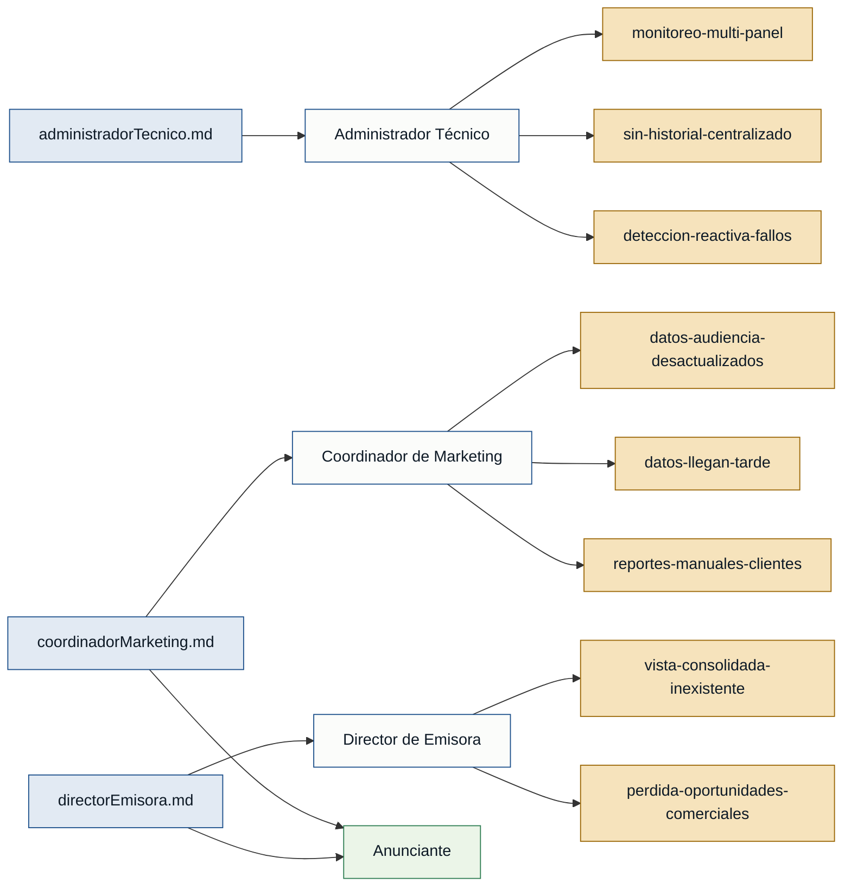

# Personas y Stakeholders — Radiostats

## Personas

### Administrador Técnico — administrador técnico de streaming
- **Contexto:** Gestiona múltiples servidores de streaming (Icecast, Shoutcast) y es responsable de que estén operativos.
- **Objetivo principal:** Monitorear todos los servidores desde un único punto y recibir alertas automáticas ante fallos, sin tener que revisar panel por panel.
- **Dolores:**
  - Debe abrir una pestaña por servidor para conocer el estado actual; proceso tedioso cuando hay varios. (administradorTecnico.md)
  - No tiene historial centralizado de métricas; analizar tendencias o investigar un incidente pasado requiere buscar registros manualmente. (administradorTecnico.md)
  - Las caídas de servidor se detectan cuando un oyente llama a avisar, no por alerta automática del sistema. (administradorTecnico.md)
- **Respaldo:** `primera mano` — entrevista propia del rol (administradorTecnico.md, 2026-06-12).

---

### Coordinador de Marketing — coordinador de marketing
- **Contexto:** Usa los datos de audiencia para vender publicidad y evaluar el impacto de campañas.
- **Objetivo principal:** Acceder a datos de audiencia actualizados, con granularidad horaria y comparativas, para tomar decisiones comerciales a tiempo y presentar reportes a clientes sin trabajo manual.
- **Dolores:**
  - Los datos de audiencia provienen de encuestas externas y llegan solo 1-2 veces al año, lo que los hace poco representativos. (coordinadorMarketing.md)
  - La información de resultado de una campaña llega después de que la campaña ya terminó, impidiendo ajustes oportunos. (coordinadorMarketing.md)
  - Preparar reportes para clientes requiere trabajo manual; no hay herramienta propia que exporte un informe presentable. (coordinadorMarketing.md)
- **Respaldo:** `primera mano` — entrevista propia del rol (coordinadorMarketing.md, 2026-06-11).

---

### Director de Emisora — director de emisora
- **Contexto:** Dirige la emisora y necesita visibilidad estratégica sobre audiencia, crecimiento y desempeño por programa para tomar decisiones y atender a anunciantes.
- **Objetivo principal:** Ver toda la información de audiencia consolidada en una sola pantalla que le permita responder consultas de anunciantes en el momento, sin buscar y cruzar datos manualmente.
- **Dolores:**
  - Los datos están repartidos entre los paneles de cada servidor; no existe una vista unificada. (directorEmisora.md)
  - Presentar información a anunciantes exige buscar reportes, exportarlos y hacer cálculos a mano, proceso que consume tiempo y hace perder oportunidades comerciales. (directorEmisora.md)
- **Respaldo:** `primera mano` — entrevista propia del rol (directorEmisora.md, 2026-06-10).

---

## Stakeholders

### Anunciante / Cliente de publicidad
- **Interés en el sistema:** Recibir datos de audiencia confiables y actualizados para evaluar dónde invertir en publicidad; espera reportes claros y precisos que justifiquen la pauta.
- **Fuente:** coordinadorMarketing.md · directorEmisora.md (mencionado por ambos entrevistados como destinatario de la información de audiencia).

> **Nota:** El anunciante no usa el sistema directamente; es el receptor final de los reportes que genera el Coordinador de Marketing o el Director de Emisora. No existe entrevista de primera mano de este rol.

---

## Mapa de trazabilidad

