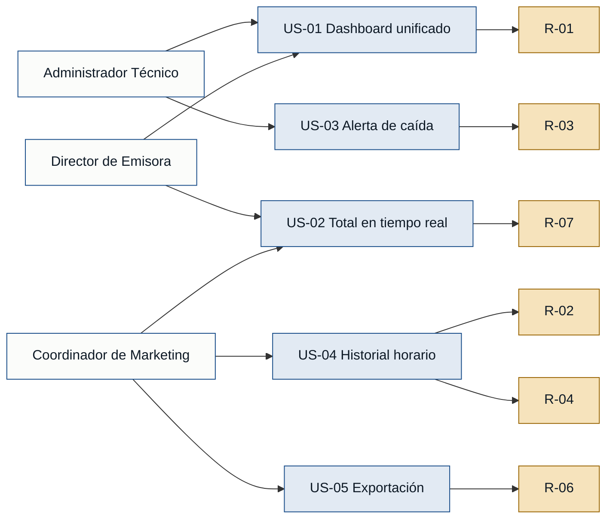

# User Stories — Radiostats

Historias ordenadas por núcleo de valor: primero las que atacan el dolor más
frecuente y compartido entre personas (vista unificada y datos en tiempo real),
luego las que resuelven dolores específicos de un rol.

---

## Núcleo de valor: visibilidad unificada y en tiempo real

### [US-01] Dashboard unificado de servidores

**Como** Administrador Técnico, **quiero** ver en una sola pantalla el estado y
el conteo de oyentes de todos los servidores de streaming configurados, **para**
no tener que abrir una pestaña por servidor cada vez que necesito conocer el
estado general.

- **Criterios de aceptación:**
  - Dado que hay N servidores configurados, cuando abro el dashboard, entonces
    veo el estado (activo / caído) y el conteo de oyentes actuales de cada uno
    en la misma vista, sin navegación adicional.
  - Dado que un servidor está caído, cuando aparece en el dashboard, entonces
    se distingue visualmente (indicador de error) del resto de servidores activos.
- **Fuente:** administradorTecnico.md · directorEmisora.md

---

### [US-02] Total consolidado de oyentes en tiempo real

**Como** Director de Emisora, **quiero** ver el total acumulado de oyentes
activos en este momento (suma de todos los servidores), **para** responder
consultas de anunciantes de forma inmediata, sin hacer cálculos manuales entre
paneles.

- **Criterios de aceptación:**
  - Dado que estoy en el dashboard, cuando lo consulto, entonces el total de
    oyentes refleja datos de hace menos de 60 segundos.
  - Dado que hay más de un servidor activo, entonces el número muestra la suma
    total y el desglose por servidor en la misma vista.
- **Fuente:** directorEmisora.md · coordinadorMarketing.md

---

## Confiabilidad operativa: alertas proactivas

### [US-03] Alerta automática de caída de servidor

**Como** Administrador Técnico, **quiero** recibir una alerta automática cuando
un servidor deja de responder, **para** detectar el fallo antes de que un oyente
llame a reportarlo.

- **Criterios de aceptación:**
  - Dado que un servidor deja de responder, cuando han transcurrido 5 minutos
    desde el último dato válido, entonces el sistema envía una notificación
    (correo o mensaje) al administrador configurado.
  - Dado que el servidor recupera conectividad, cuando vuelve a responder,
    entonces el sistema envía una notificación de recuperación.
  - Dado que el sistema detecta la caída, entonces el dashboard la muestra en
    tiempo real con marca de hora de inicio.
- **Fuente:** administradorTecnico.md

---

## Análisis histórico: datos propios para decisiones comerciales

### [US-04] Historial de audiencia con granularidad horaria

**Como** Coordinador de Marketing, **quiero** consultar la audiencia histórica
con granularidad horaria y comparar rangos de fechas, **para** identificar
tendencias y medir el impacto real de las campañas sin esperar encuestas externas.

- **Criterios de aceptación:**
  - Dado un rango de fechas seleccionado, cuando lo consulto, entonces veo un
    gráfico con el número de oyentes por hora para ese periodo.
  - Dado dos rangos de fechas distintos, cuando los selecciono, entonces puedo
    compararlos en la misma vista (al menos día a día y semana a semana).
  - Dado que una campaña estuvo activa en un periodo, cuando lo consulto, entonces
    el pico de audiencia de ese periodo es visible en el gráfico sin cálculo adicional.
- **Fuente:** coordinadorMarketing.md

---

### [US-05] Exportación de reporte de audiencia

**Como** Coordinador de Marketing, **quiero** exportar un reporte de audiencia
listo para presentar a clientes, **para** no construirlo manualmente cada vez
que un anunciante solicita justificación de la pauta.

- **Criterios de aceptación:**
  - Dado un rango de fechas y métricas seleccionadas, cuando activo la
    exportación, entonces obtengo un archivo (PDF o CSV) con los datos formateados
    y el nombre de la emisora.
  - Dado que el reporte se genera, entonces incluye totales, gráfico de tendencia
    horaria y el nombre del período analizado, sin edición adicional.
- **Fuente:** coordinadorMarketing.md

---

## Diagrama de trazabilidad — historias ↔ personas ↔ requisitos

